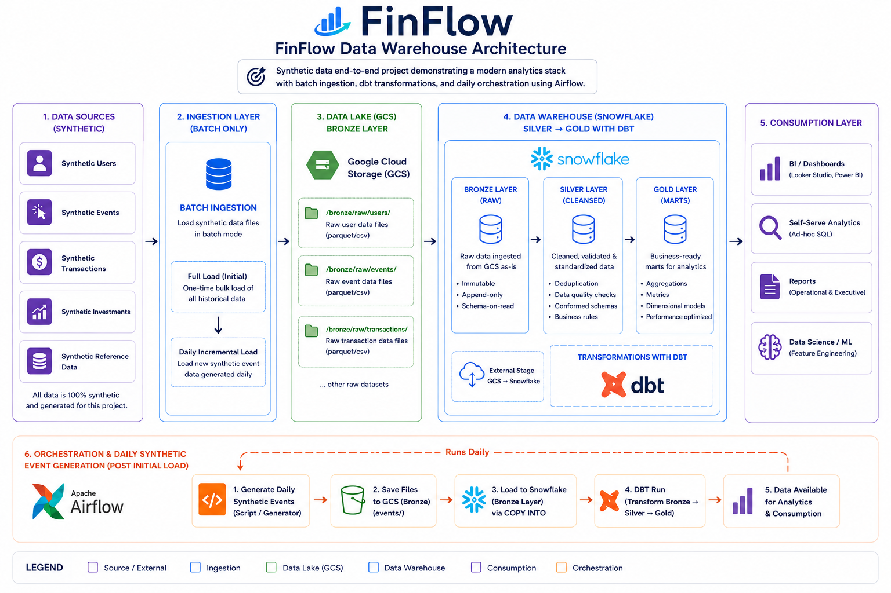
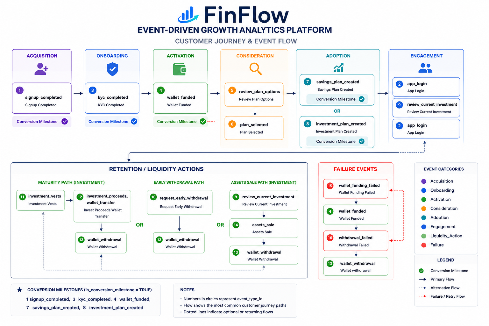

# FinFlow Product Analytics Engineering Platform

Event-driven fintech analytics platform combining analytics engineering and product analytics to model user behavior, retention, growth, and financial activity at scale.

---

# Problem Statement

Modern fintech products generate large volumes of user behavioral and transactional data across multiple channels including mobile applications, payment systems, and investment platforms. Every user action from onboarding and account funding to transfers, investments, and daily engagement produces event-level data that needs to be captured, processed, and converted into meaningful business insights.

In many early-stage and scaling fintech companies, building a reliable and scalable analytics system is still a major challenge.

Without a well-designed analytics platform, teams typically face issues such as:

- Data being spread across multiple products and systems, which makes it difficult to get a unified view of the customer
- Inconsistent definitions of key metrics like revenue, active users, and retention across teams
- Slow query performance due to unoptimized data models and storage structures
- Heavy reliance on full refresh processes that do not scale with growing data volumes
- Limited visibility into customer behaviour across the full lifecycle and across products
- Difficulty accurately tracking funnels, retention, and cross-product adoption
- Lack of automated and reliable pipelines for daily data ingestion and transformation

This project is designed to address these challenges by building a production-style fintech product analytics and analytics engineering platform that simulates how modern digital financial systems collect, process, model, and analyze large-scale event-driven data across multiple products.

---

# Project Objectives

This project aims to design and implement a production-style **fintech product analytics** and analytics engineering platform that simulates how modern digital financial systems collect, process, model, and analyze behavioral and transactional data.

The platform is built to achieve the following objectives:

- Generate realistic synthetic event streams for a multi-product fintech platform, modeling customer behavior across wallet funding, payments, savings, investments, and other money movement activities.
- Model end-to-end customer journeys to support product analytics use cases such as retention, funnels, and cross-product engagement
- Design a scalable data architecture with historical backfills and incremental daily ingestion patterns
- Implement a partitioned data lake structure and transform raw data into analytics-ready models using dbt
- Build consistent product and growth metrics to enable reliable reporting and decision-making
- Support core analytics use cases including cohort analysis, funnel analysis, and user behavior tracking
- Simulate automated daily data pipelines using scheduled orchestration workflows
- Deliver curated datasets optimized for BI dashboards and business insights in Power BI
- Demonstrate best practices in analytics engineering including modular modeling, incremental processing, and scalable ELT design

The project focuses on demonstrating modern analytics engineering and product analytics practices commonly used in startup environments, including:

- Event-driven data modeling for capturing user behavior across product interactions
- Partition-aware warehouse design for scalable and efficient data storage
- Incremental ELT pipelines for optimized processing of growing data volumes
- Workflow orchestration and automation for reliable daily data ingestion
- Scalable dimensional modeling using fact and dimension tables
- Product and growth analytics to support insights on retention, funnels, and engagement

---

## Business Questions Answered

The platform is designed to answer questions such as:

- What percentage of users successfully activate after signup?
- Which acquisition channels generate the highest activation rates?
- Which customer personas drive the highest AUM?
- What percentage of users adopt savings versus investment products?
- How does retention vary by customer segment?
- What customer behaviours are leading indicators of churn?
- What is the relationship between engagement and product adoption?

---

# Tech Stack

| Layer | Tool |
|---|---|
| Data generation | Python (Faker, NumPy, Pandas) |
| Workflow Orchestration| Airflow |
| Compute & Infrastructre| Google Compute Engine (GCE,Linux), Git-based deployment |
| Storage | Google Cloud Storage |
| Warehouse | Snowflake / DuckDB |
| Transformation | dbt |
| Visualization | Power BI |

---


# Architecture Overview

## High-Level Architecture

```text
Python Event Generator
        ↓
Orchestration Layer (Airflow)
        ↓
Raw Data Lake (Partitioned by Event Date)
        ↓
Data Warehouse (Snowflake)
        ↓
dbt Transformation Layer
        ↓
Analytics Marts
        ↓
BI Dashboards (Power BI)
```

## Data Lakehouse and Warehouse Architecture

The project implements a Medallion-inspired transformation pattern using dbt within Snowflake, with raw data stored in S3.
```
Python scripts → S3 (data lake) → Snowflake (warehouse) + dbt (transformations implementing Medallion architecture: Bronze, Silver, Gold) → Power BI
```

- **Bronze** — raw ingested data
- **Silver** — cleaned, standardized, and enriched datasets
- **Gold** — aggregated, analytics-ready data marts



---

# Product or Platform Event Flow



---

# Synthetic Data Generation

All datasets are fully synthetic, generated using custom Python modules built on Pandas and NumPy.

- An initial three-year historical dataset is generated, covering customer activity from three years ago through the previous day.
- A scheduled DAG simulates a daily batch ingestion process by generating synthetic event data for the previous day at 9 AM and and writes it as a new partition in the historical dataset.
- The data simulates user activity within a fintech platform consisting of two core products:
    - A digital savings product
    - A digital investment product

The dataset is low-medium frequency but behaviour rich.

Generated datasets are exported as Parquet files for efficient storage and downstream ingestion into S3 and Snowflake.

> The full data generation rules documentation covering the end-to-end data generation guidleine is available in [Data Generation Rules](https://github.com/ajibola-komo/FinFlow-Product-Analytics-Engineering-Platform/blob/main/docs/documentation/data-generation/data-generation-rules.md).


---

## Data Model
Star schema with 3 fact tables, 3 operational snapshot tables and 7 dimension tables.


| Table | Type | Grain | Approx. rows |
|---|---|---|---|
| `dim_date` | dimension | One record per calendar date | ~3,650 rows |
| `dim_event_type` | dimension | One record per distinct event type | 14 rows |
| `dim_product` | dimension | One record per distinct product offering | 2 rows |
| `dim_plan` | dimension | One record per product plan variant | 4 rows |
| `dim_user` | dimension | One record per registered user | ~500K rows |
| `dim_wallet` | dimension | One record per user wallet account (one wallet per user) | ~500K rows |
| `dim_transaction_type` | dimension | One record per distinct transaction type | 6 rows |
| `fact_user_event` | fact | One record per user generated event occurence | ~12M rows |
| `fact_investment_position` | fact | One record per investment position created by a user  | ~1.1M rows |
| `fact_transaction` | fact | One record per money movement transaction within the application | ~5M rows |
| `wallet_current_state` | snapshot | Latest wallet state per wallet account (based on latest pipeline run) | ~2,000,000 rows |
| `investment_position_current_state` | snapshot | Latest investment position state  | ~1,100,000 rows |
| `user_current_state` | snapshot | Latest user lifecycle state  | ~2,000,000 rows |

> The full data dictionary covering all fact & dimension tables, column definitions, data types, and grain is available in [Source Data Dictionary](https://github.com/ajibola-komo/FinFlow-Product-Analytics-Engineering-Platform/blob/main/docs/documentation/data-generation/01-Finflow%20End-To-End%20Analytics%20-%20Source%20Data%20Dictionary.pdf)

---

## BI Layer Strategy

The project uses Power BI as the visualisation layer since it connects directly to Snowflake.

This simulates a real-world semantic layer where downstream BI tools consume governed, pre-aggregated datasets rather than querying raw data sources directly.

## Dashboard Preview

### Executive Dashboard

[screenshot]

### Product Analytics Dashboard

[screenshot]

### Retention Dashboard

[screenshot]

### Customer Segmentation Dashboard

[screenshot]

## Key Skills Demonstrated

- Analytics Engineering
- Product Analytics
- Data Modeling
- SQL
- Python
- Snowflake
- dbt
- Airflow
- Google Cloud Storage
- Power BI
- Customer Lifecycle Analytics
- Funnel Analysis
- Cohort Analysis
- Retention Analytics

## Authour
**Ajibola Komolafe** — Analytics Engineer | Data Analyst
- [LinkedIn](https://www.linkedin.com/in/ajibola-k-4ba921123/) 
- [GitHub](https://github.com/ajibola-komo)
- [Kaggle](https://github.com/ajibola-komo)
- [Power BI](https://github.com/ajibola-komo)